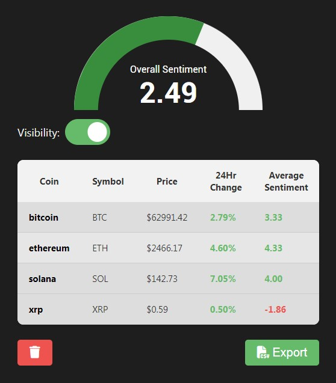

# X-Crypto-Bro-Extension

A browser extension that analyzes the sentiment of cryptocurrency-related tweets in real-time, providing insights into market sentiment for various coins. The extension includes a sentiment gauge, real-time data on popular cryptocurrencies, a toggle switch to control the visibility of sentiment indicators in X's website and the ability to export sentiment data as a CSV file.

## 🚀 Features

- **Sentiment Analysis:** Uses natural language processing to evaluate tweets related to cryptocurrencies.
- **Real-time Coin Data:** Displays live data such as price, percentage change, and sentiment for popular coins like Bitcoin, Ethereum, and others.
- **User Interface:** Includes a modern sentiment gauge and a table of coins with real-time updates.
- **Toggle Visibility:** Allows users to toggle the visibility of sentiment indicators across tweets.
- **Data Export:** Enables users to export the sentiment table as CSV.
  
## 🛠️ Installation

### Prerequisites
- Google Chrome (or any Chromium-based browser)

### Steps
1. Clone the repository:

   ```bash
   git clone https://github.com/leonardomagalhaes21/X-Crypto-Bro-Extension.git
   ```

2. Open Chrome and navigate to `chrome://extensions/`.

3. Enable **Developer Mode** at the top-right corner of the page.

4. Click on **Load Unpacked** and select the `x-crypto-bro-extension` folder.

5. The extension will now be installed and ready for use!

## 📋 Usage

### Analyzing Tweets
- The extension automatically scans tweets and calculates the sentiment score using a sentiment analysis library.
- Hover over sentiment indicators to view exact scores for each tweet.

### Sentiment Gauge
- The sentiment gauge updates in real-time based on crypto-related tweets analyzed on the page.

### Visibility Toggle
- The extension includes a visibility toggle that can show or hide sentiment indicators.

## 🎨 Screenshots

### Sentiment Gauge & Coin Data Table


### Sentiment Indicator on Tweets


## 🤖 Technology Stack

- **Sentiment Analysis:** [Sentiment.js](https://github.com/thisandagain/sentiment)
- **Cryptocurrency Data:** Real-time crypto data fetched using a public API (CoinCap API).
- **Browser API:** Uses the Chrome Extensions API to interact with the webpage.
- **JavaScript/HTML/CSS:** Technologies for the extension logic and UI.

## 🌱 Future Enhancements

- **Multiple Language Support:** Expand sentiment analysis to support languages beyond English.
- **User Configurations:** Allow users to add or remove coins from the list dynamically.
- **Enhanced Charts:** Add more detailed graphs for sentiment trends over time.
- **AI-Powered Sentiment Analysis:** Integrate advanced AI tools or machine learning models (e.g., GPT-based or NLP models) to improve the accuracy and depth of sentiment analysis.
- **Market Predictions:** Utilize AI and historical price data to make cryptocurrency market predictions based on past trends and price history.
